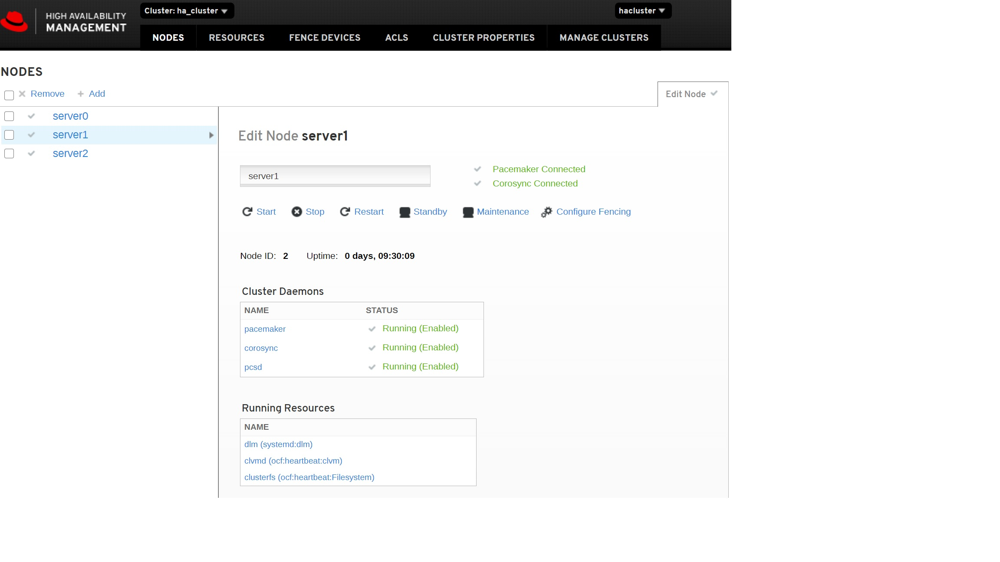
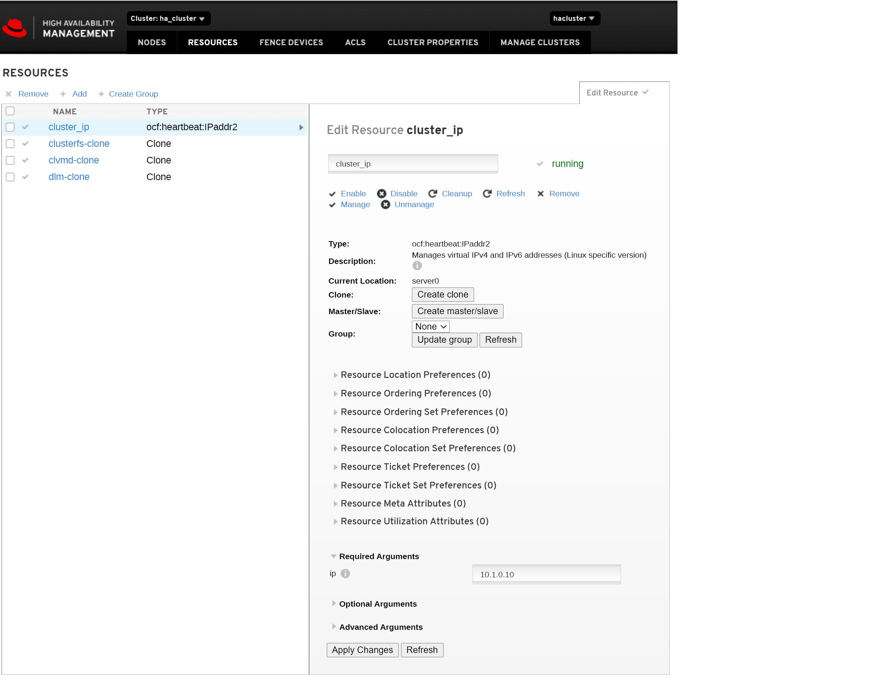

# pcm - домашка по созданию кластера на pacemaker
По сценарию задания создаётся через терраформ 4 Виртуальные Машины (далее -ВМ). Одна из которых является iscsi-таргетом. Остальные 3ВМ будут инициаторами iscsi.
# запуск стенда
* после отработки манифеста терраформа становятся известными адреса машин, которые следует добавить в инвентори (можно автоматизировать, но я не дорос ещё до этого)
* запускаем настройку хостов 
```
ansible-playbook site.yml
```
После выполнения тасков без ошибок, выполняем настройку ресурсов кластера
```
pcs cluster start --all
pcs property set stonith-enabled=false
pcs property set no-quorum-policy=freeze
pcs resource create dlm systemd:dlm op monitor interval=30s on-fail=ignore clone interleave=true ordered=true
pcs resource create clvmd ocf:heartbeat:clvm op monitor interval=30s on-fail=ignore clone interleave=true ordered=true
pcs constraint order start dlm-clone then clvmd-clone
pcs resource create cluster_ip ocf:heartbeat:IPaddr2 ip=10.1.0.10 cidr_netmask=24 op monitor interval=30s
pcs status resources

pvcreate /dev/mapper/sdb
vgcreate -Ay -cy cluster_vg /dev/sdb  
lvcreate -L900M -n cluster_lv cluster_vg
mkfs.gfs2 -j3 -p lock_dlm -t ha_cluster:gfs2 /dev/cluster_vg/cluster_lv
pcs resource create clusterfs Filesystem device="/dev/cluster_vg/cluster_lv" directory="/mnt/gfs2"  fstype="gfs2" "options=noatime" op monitor interval=10s  on-fail=ignore clone interleave=true
pcs constraint order start clvmd-clone then clusterfs-clone
pcs constraint colocation add clusterfs-clone with clvmd-clone
```
# просмотр резульатов работы
Заходим по внешнему адресу на любую ноду, подключаемся через web-ui и видим, что всё в порядке. Все ноды работают, ресурсы не блокированы.
```
[root@server2 adminroot]# pcs status
Cluster name: ha_cluster
Stack: corosync
Current DC: server1 (version 1.1.23-1.el7_9.1-9acf116022) - partition with quorum
Last updated: Mon Mar  1 05:25:16 2021
Last change: Mon Mar  1 04:36:16 2021 by root via cibadmin on server2

3 nodes configured
10 resource instances configured

Online: [ server0 server1 server2 ]

Full list of resources:

 cluster_ip     (ocf::heartbeat:IPaddr2):       Started server0
 Clone Set: dlm-clone [dlm]
     Started: [ server0 server1 server2 ]
 Clone Set: clvmd-clone [clvmd]
     Started: [ server0 server1 server2 ]
 Clone Set: clusterfs-clone [clusterfs]
     Started: [ server0 server1 server2 ]

Daemon Status:
  corosync: active/enabled
  pacemaker: active/enabled
  pcsd: active/enabled
```


